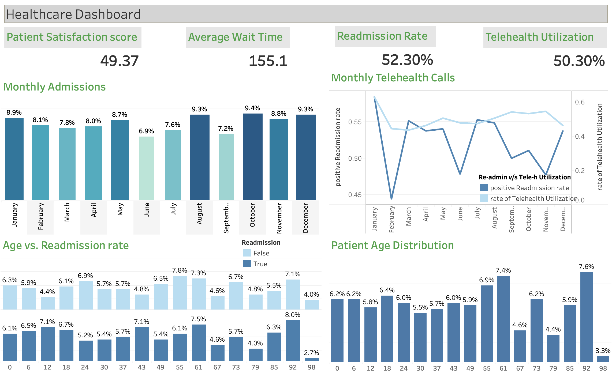

# Dashboard 3: Healthcare

KPI Metrics: Patient Satisfaction, Average Wait Time, Readmission Rate, Telehealth Utilization
Charts: Monthly Admissions, Patient Age Distribution, Readmission and Telehealth Rate, Monthly Telehealth Calls

**Project Problem Statement:**

In the complex and dynamic realm of healthcare, the need for data-driven decision-making is paramount. Healthcare facilities strive to deliver high-quality care while optimizing their operations, but they often grapple with disjointed data and a lack of comprehensive insights. The primary problem is the absence of a centralized platform to monitor and analyze key performance metrics critical to healthcare organizations, including Patient Satisfaction, Average Wait Time, Readmission Rate, and Telehealth Utilization.

**Objective:**

The primary objective of this project is to design and implement a Tableau dashboard tailored to the healthcare sector. This dashboard will consolidate key performance indicators (KPIs) and data visualizations, providing healthcare stakeholders with actionable insights and the ability to make informed decisions. The specific goals of this project include:

1. **Data Integration:** Aggregate and integrate diverse healthcare data sources to create a unified dataset that serves as the foundation for the dashboard.

2. **KPI Visualization:** Develop interactive visualizations that allow stakeholders to monitor and analyze Patient Satisfaction, Average Wait Time, Readmission Rate, and Telehealth Utilization. These visualizations should offer real-time updates and historical trends.

3. **Monthly Admissions:** Create a chart depicting monthly patient admissions, enabling healthcare facilities to identify patterns and plan resource allocation accordingly.

4. **Patient Age Distribution:** Visualize the distribution of patient ages to gain insights into the demographics of the patient population.

5. **Readmission and Telehealth Rate:** Present comparative visualizations of Readmission Rate and Telehealth Utilization, helping healthcare organizations assess the effectiveness of their programs.

6. **Monthly Telehealth Calls:** Develop a chart displaying the volume of telehealth calls each month, allowing healthcare providers to track the growth and utilization of remote healthcare services.

7. **User-Friendly Dashboard:** Construct an intuitive and user-friendly Tableau dashboard that accommodates users with varying levels of data analysis expertise. It should provide filtering options and customized reporting features.

**Future Scope:**

The project serves as a foundation for future enhancements and expansions of the Healthcare Dashboard, including:

- **Advanced Analytics:** Integration of predictive modeling to forecast patient admissions and telehealth utilization.
- **Data Enrichment:** Incorporation of external data sources such as patient feedback and healthcare provider reviews.
- **Mobile Accessibility:** Development of a mobile-responsive version for on-the-go access by healthcare professionals.

**Conclusion:**

This project endeavors to address the critical need for data-driven decision-making in the healthcare sector. The Tableau Healthcare Dashboard provides valuable insights into essential KPIs and trends, aiding healthcare organizations in improving patient satisfaction, optimizing wait times, reducing readmissions, and maximizing the utilization of telehealth services. As the healthcare landscape evolves, this dashboard stands as a vital tool for informed decision-making, with the potential for continuous improvement and expansion.

