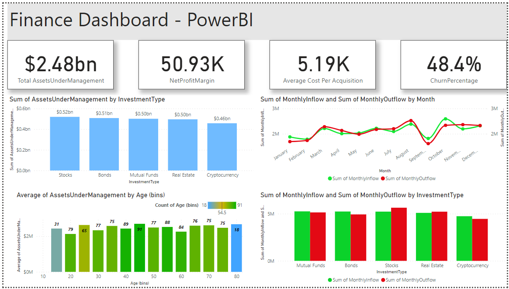

# Dashboard 4: Managing Financial Assets

KPI Metrics: Total Assets Under Management, Net Profit Margin, Average Cost Per Acquisition, Churn Percentage
Charts: Asset Under Managemebt by Investment Types, Monthly Inflow vs Outflow by Month, Asset Under Managemebt byCustomer Age Group, Sum of Inflow and Outflow by Investment Type

**Dashboard Framework: Managing Financial Assets**

**Problem Statement:**
The financial industry faces challenges in effectively managing assets, tracking profitability, and optimizing customer acquisition. There is a need for a centralized dashboard that provides real-time insights to address these issues.

**Objectives:**
1. **Centralized Data Access:** Create a single platform for accessing financial data, enhancing efficiency in decision-making.
2. **Performance Monitoring:** Monitor and improve key financial metrics such as Total Assets Under Management (AUM), Net Profit Margin, Average Cost Per Acquisition (CPA), and Churn Percentage.
3. **Visual Data Presentation:** Utilize charts and graphs to simplify complex financial data, aiding in better comprehension and analysis.
4. **User-Friendly Interface:** Develop an intuitive dashboard that is accessible to both technical and non-technical users.

**KPI Metrics:**
1. **Total Assets Under Management (AUM):** Track the total value of assets managed by the organization to assess growth and performance.
2. **Net Profit Margin:** Measure profitability by calculating the ratio of net profit to total revenue.
3. **Average Cost Per Acquisition (CPA):** Determine the average cost incurred to acquire new customers.
4. **Churn Percentage:** Analyze customer retention by calculating the percentage of customers lost over a specific period.

**Charts:**
1. **Asset Under Management by Investment Types:** Visualize AUM distribution across various investment types (e.g., stocks, bonds, real estate).
2. **Monthly Inflow vs. Outflow by Month:** Display the monthly trend of funds inflow and outflow to identify cash flow patterns.
3. **Asset Under Management by Customer Age Group:** Categorize AUM by age groups to target demographic-specific strategies.
4. **Sum of Inflow and Outflow by Investment Type:** Show the sum of funds inflow and outflow for each investment type to assess popularity and trends.

**Future Scope:**
1. **Predictive Analytics:** Incorporate predictive modeling to forecast future AUM, profitability, and customer behavior.
2. **User Customization:** Allow users to personalize their dashboard views and choose KPIs and charts of interest.
3. **Data Integration:** Integrate external data sources for a more comprehensive financial overview.
4. **Mobile Accessibility:** Develop a mobile version of the dashboard for on-the-go access.

**Conclusion:**
The development of this financial asset management dashboard addresses the critical need for efficient data management and analysis in the financial sector. By monitoring key metrics and presenting data through visualizations, it empowers organizations to make informed decisions, enhance profitability, and optimize customer acquisition strategies. The future scope includes further enhancements to provide even more valuable insights and customization options for users.

