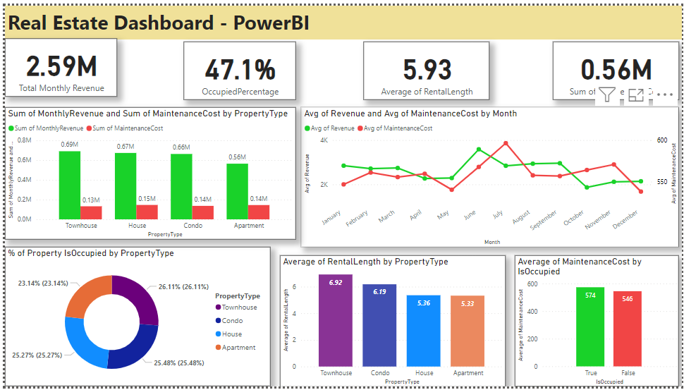

# Dashboard 5: Real Estate Property Management Dashboard

**Dashboard Framework: Property Management Insights**

**Problem Statement:**
Property management companies face challenges in optimizing revenue, occupancy rates, and maintenance costs. To address these challenges, there is a need for a centralized dashboard that provides real-time insights.

**Objectives:**
1. **Centralized Data Access:** Create a single platform for accessing property management data, enhancing decision-making and efficiency.
2. **Performance Monitoring:** Monitor and improve key property management metrics such as Total Monthly Revenue, Occupancy Rate, Average Rental Length, and Total Maintenance Costs.
3. **Visual Data Presentation:** Utilize charts and graphs to simplify complex property data, aiding in better comprehension and analysis.
4. **User-Friendly Interface:** Develop an intuitive dashboard accessible to both technical and non-technical users.

**KPI Metrics:**
1. **Total Monthly Revenue:** Track the total revenue generated from properties each month to assess financial performance.
2. **Occupancy Rate:** Measure the percentage of occupied properties compared to the total available properties.
3. **Average Rental Length:** Calculate the average duration of property rentals.
4. **Total Maintenance Costs:** Monitor the cumulative costs associated with property maintenance.

**Charts:**
1. **Monthly Revenue & Maintenance by Property Type:** Visualize the monthly revenue and maintenance costs breakdown by property types (e.g., apartments, houses, commercial properties).
2. **Average of Revenue & Maintenance by Month:** Display the average monthly revenue and maintenance costs to identify trends and seasonality.
3. **Occupancy by Property Type:** Categorize occupancy rates by property types to identify which types are in higher demand.
4. **Average Rental Length by Property Type:** Show the average rental duration for different property types.
5. **Average of Maintenance Cost by Occupier Property:** Calculate the average maintenance cost per occupier property to identify areas where maintenance is more intensive.

**Future Scope:**
1. **Predictive Analytics:** Incorporate predictive modeling to forecast future revenue, occupancy rates, and maintenance costs.
2. **User Customization:** Allow users to personalize their dashboard views and choose KPIs and charts of interest.
3. **Data Integration:** Integrate external data sources (e.g., market trends, weather data) for a more comprehensive property management overview.
4. **Mobile Accessibility:** Develop a mobile version of the dashboard for on-the-go access.

**Conclusion:**
The development of this property management insights dashboard addresses the critical need for efficient property data management and analysis. By monitoring key metrics and presenting data through visualizations, it empowers property management companies to make informed decisions, optimize revenue, and manage maintenance effectively. The future scope includes further enhancements to provide even more valuable insights and customization options for users.